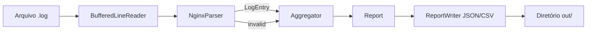

<div align="center">


<p>
  <strong>Pipeline de análise de logs rápido, seguro e testável</strong><br/>
  Processa arquivos grandes (MB → GB) <strong>linha por linha</strong>, extrai métricas de observabilidade e exporta relatórios em <strong>JSON/CSV</strong>.
</p>

<p>
  <!-- Badges (troque USER/REPO pelo seu) -->
  
  
  
  
</p>

<p>
  <!-- CI badge (descomente após criar o workflow e trocar USER/REPO) -->
  <!--  -->
</p>

</div>

---

## Visão geral

Logs são o “diário” de um sistema. Em produção, eles viram rapidamente **milhões de linhas** e precisam ser analisados com eficiência para responder perguntas como:

- Quantos erros **500** aconteceram hoje?
- Quais endpoints são os mais acessados?
- Houve **pico** de tráfego por minuto?
- Qual a latência **p95** (o tempo que 95% das requisições ficam abaixo)?

O **LogForge** é um CLI em C++20 que resolve isso com um pipeline simples e profissional:

**Reader → Parser → Aggregator → ReportWriter**

- **Reader**: lê o arquivo em streaming (sem estourar RAM)
- **Parser**: transforma uma linha bruta em dados estruturados (ou marca como inválida)
- **Aggregator**: acumula contagens/estatísticas com memória controlada
- **ReportWriter**: exporta relatórios em formatos prontos para análise

---

## Por que isso é diferencial no currículo

Este projeto não é “só um código que compila”. Ele demonstra exatamente o que empresas procuram em estágio/júnior:

- **Pensamento de produção**: tolerância a logs sujos (linhas inválidas não derrubam o programa)
- **Performance real**: streaming, parsing eficiente (sem regex), baixa pressão de memória
- **Qualidade de engenharia**: CMake, organização em **library + CLI**, warnings rígidos
- **Confiabilidade**: testes automatizados (opcional) e modo benchmark (linhas/s)
- **Segurança de memória**: suporte a sanitizers (ASan/UBSan) para detectar bugs difíceis

---

## Features

### Métricas calculadas
- Contagem por **status HTTP** (200/404/500…)
- **Top endpoints** mais acessados (configurável com `--top`)
- **Requisições por minuto** (para detectar picos)
- **Latência**: min/avg e percentis aproximados (**p50/p95/p99**) via histograma (streaming-friendly)

### Exportação
- `report.json` (bom para dashboards/automação)
- CSVs:
  - `status_counts.csv`
  - `top_endpoints.csv`
  - `requests_per_minute.csv`
  - `latency_summary.csv`

---

## Quick start

### 1) Build (Release)
```bash
cmake -S . -B build -DCMAKE_BUILD_TYPE=Release -DBUILD_TESTING=OFF
cmake --build build -j
```

### 2) Rodar com log de exemplo
```bash
./build/logforge --in data/sample_nginx.log --out out
```

### 3) Benchmark (throughput)
```bash
./build/logforge --in data/sample_nginx.log --out out --bench
```

> Dica: para medir performance de verdade, use um arquivo grande. Existe um gerador em `scripts/`.

---

## Exemplo de formato de log suportado (Nginx)

Formato típico (Nginx “combined”) com `request_time` no final (segundos):
```txt
127.0.0.1 - - [10/Oct/2000:13:55:36 -0700] "GET /api/items?id=1 HTTP/1.1" 200 2326 "-" "Mozilla/5.0" 0.245
```

O parser do projeto também tenta ser robusto com variações comuns:
- espaços extras no final
- ausência de `request_time` (latência fica como `-1`)
- endpoint com querystring (`?q=...`) é normalizado para apenas o path

---

## Saídas geradas

Após executar, o diretório `out/` terá:

- `report.json` (resumo completo)
- `status_counts.csv`
- `top_endpoints.csv`
- `requests_per_minute.csv`
- `latency_summary.csv`

### Exemplo (trecho) de `report.json`
```json
{
  "summary": {
    "total_lines": 500000,
    "parsed_lines": 499120,
    "invalid_lines": 880
  },
  "latency_ms": {
    "count": 499120,
    "min": 2,
    "avg": 121.7,
    "p50": 100,
    "p95": 350,
    "p99": 650,
    "max": 9800
  }
}
```

---

## Opções do CLI

```bash
logforge --in <arquivo.log> --out <diretorio_saida> [--top N] [--bench]
```

- `--in`: caminho do arquivo de log (obrigatório)
- `--out`: diretório de saída (padrão: `out`)
- `--top`: quantidade de endpoints no ranking (padrão: 20)
- `--bench`: não gera relatórios; imprime métricas de execução (tempo/linhas por segundo)

---

## Sanitizers (ASan/UBSan)

Sanitizers ajudam a detectar bugs difíceis (uso após free, overflow, UB) durante debug:

```bash
cmake -S . -B build-asan -DCMAKE_BUILD_TYPE=Debug -DENABLE_SANITIZERS=ON -DBUILD_TESTING=OFF
cmake --build build-asan -j
./build-asan/logforge --in data/sample_nginx.log --out out
```

---

## Testes automatizados (opcional)

Os testes usam Catch2 via `FetchContent` (requer internet na primeira configuração):

```bash
cmake -S . -B build-tests -DCMAKE_BUILD_TYPE=Debug -DBUILD_TESTING=ON
cmake --build build-tests -j
ctest --test-dir build-tests --output-on-failure
```

---

## Benchmark com log sintético

Gere um log grande e rode o modo benchmark:

```bash
mkdir -p out
python3 scripts/gen_synth_log.py --out out/synth.log --lines 200000 --start "2025-01-01 00:00:00"
./build/logforge --in out/synth.log --out out/report --bench
```

---

## Arquitetura (alto nível)



---

## Estrutura do repositório

```txt
logforge/
  include/logforge/      # headers públicos
  src/                   # implementação (parser, agregação, writers)
  data/                  # logs de exemplo
  scripts/               # gerador de logs sintéticos + benchmark
  tests/                 # testes (opcional)
  cmake/                 # módulos (sanitizers)
  .github/workflows/     # CI (opcional)
```

---

## Roadmap (ideias de evolução)

- `--format auto` e suporte a mais formatos (Apache/app logs)
- Export `.jsonl` para ingestão estilo ELK
- Métricas extras:
  - error rate por endpoint
  - top endpoints por status (ex: top 500)
  - heatmap por minuto
- CI mais completa:
  - sanitizers no GitHub Actions
  - clang-format/clang-tidy
- Parser ainda mais rápido (redução de cópias e alocações)

---

## Como citar no currículo (exemplo)

**LogForge (C++20)**: analisador de logs em streaming com métricas de observabilidade e relatórios JSON/CSV. Projeto com foco em performance e qualidade (CMake, testes, sanitizers, benchmark).

---

## Licença
Defina uma licença (MIT é comum) e adicione um `LICENSE` se quiser publicar publicamente.

---

<div align="center">

Feito para aprender C++ “de verdade”: performance, robustez e engenharia de software.

</div>
